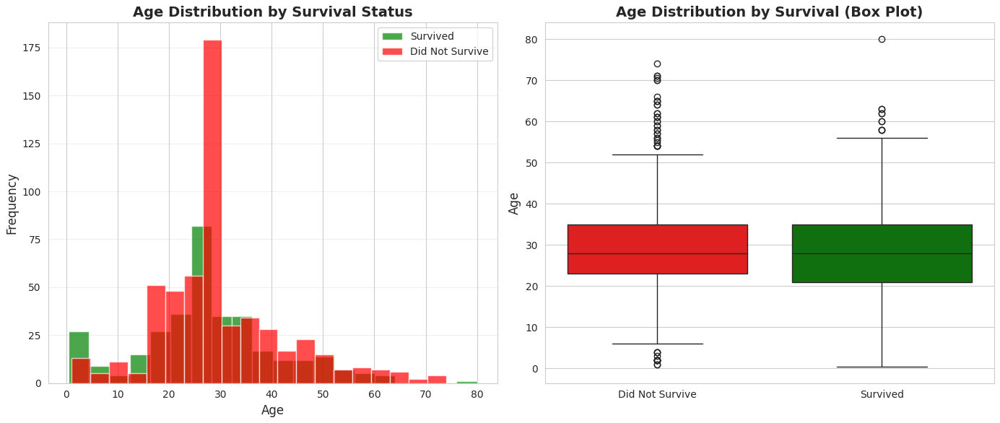
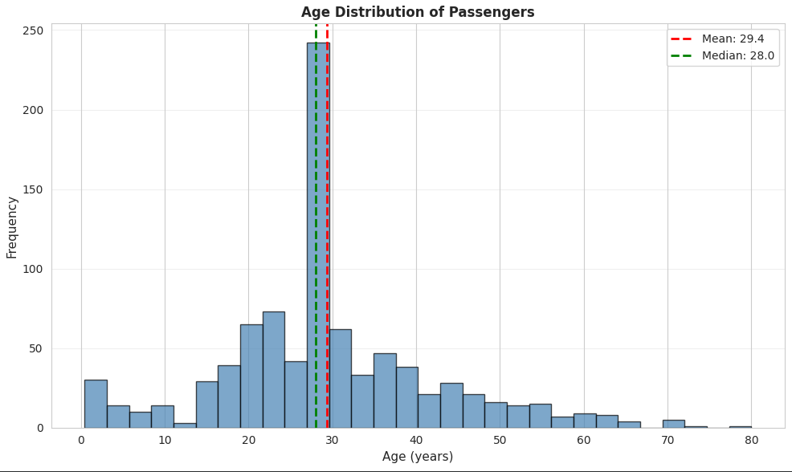
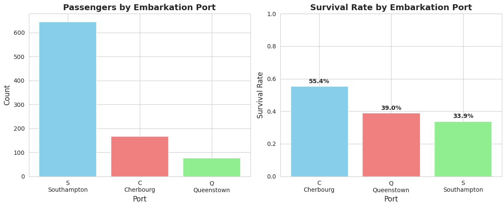
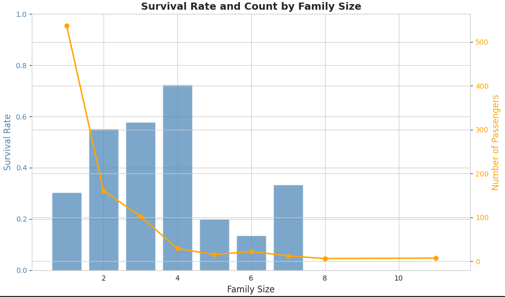
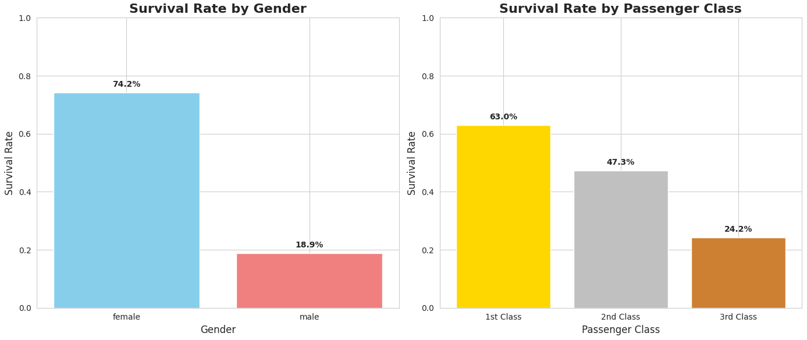
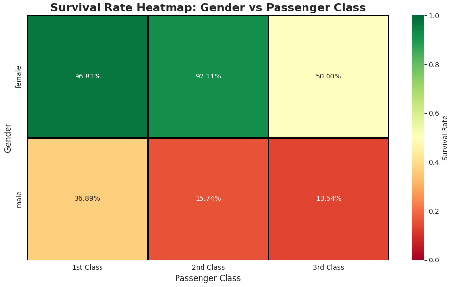

# 🛳️ EDA-Titanic  
Basic Exploratory Data Analysis (EDA) of the Titanic dataset  

---

## 🚀 Project Overview  
This repository presents a comprehensive exploratory data analysis of the **Titanic passenger dataset** from Kaggle. The objective is to uncover key patterns behind passenger survival rates, understand relationships between demographic and socio-economic factors, and demonstrate a structured analytical workflow — from data cleaning to hypothesis testing.

---

## 🎯 Objectives  
- Strengthen analytical and visualization skills using Python’s data ecosystem  
- Practice turning messy data into clear, evidence-backed insights  
- Build a portfolio-ready EDA project showcasing practical data storytelling  

---

## 🧰 Tools & Technologies  
- **Language:** Python 3  
- **Libraries:** `pandas`, `numpy`, `matplotlib.pyplot`, `seaborn`, `scipy`  
- **Platform:** Google Colab  

---

## 📂 File Structure

### 🧹 Data Preparation  
1. Identified and handled **missing values**  
2. Removed **duplicate records**  
3. Created new derived features:
   - **Age Group**: Categorized passengers into “Child,” “Adult,” and “Senior”  
   - **Family Size**, **IsAlone**, and other engineered features  
4. Detected and addressed **outliers**  
5. Ensured clean, well-formatted data for reliable analysis  

### 📊 Exploratory Data Analysis  
- **Descriptive Summary:** Central tendency and spread of numeric features  
- **Univariate Analysis:** Distribution of age, fare, and class  
- **Bivariate Analysis:**  
  - Survival rate by gender, class, and age group  
  - Correlation heatmap of numerical variables  
- **Visualizations:**  
  - Gender & Class Distribution (Bar Charts)  
  - Age vs. Survival (Histogram & Boxplot)  
  - Class-wise Survival Heatmap  
  - Additional insights-driven plots  

### 📈 Statistical Insights  
- **Central Measures:** Mean, Median, and Mode of key features  
- **T-Test:** Tested statistical significance of survival rate differences between genders  
- **Findings:** Female passengers had significantly higher survival odds, confirming early-life-boat-priority patterns ("Women and children first")  

---

## 🧠 Key Takeaways  
- **Gender and Class** were the most influential survival predictors  
- **Family presence** improved survival chances, but only up to a limit  
- Data visualization revealed strong socio-economic biases in survival distribution  
- Demonstrated an end-to-end EDA workflow applicable to real-world datasets  

---

## 📌 Future Scope  
- Apply **logistic regression** or **decision trees** for predictive modeling  
- Extend analysis using additional Kaggle Titanic features  
- Automate cleaning and visualization with a Python script  

---

## 📷 Charts Visual

---

## 🤝 Acknowledgments  
Dataset: [Kaggle - Titanic: Machine Learning from Disaster](https://www.kaggle.com/c/titanic)  
Developed and analyzed by **Nanishat**  
